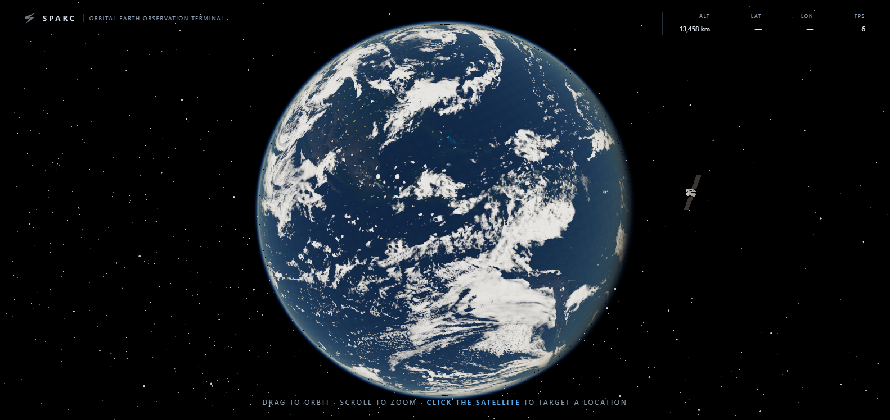
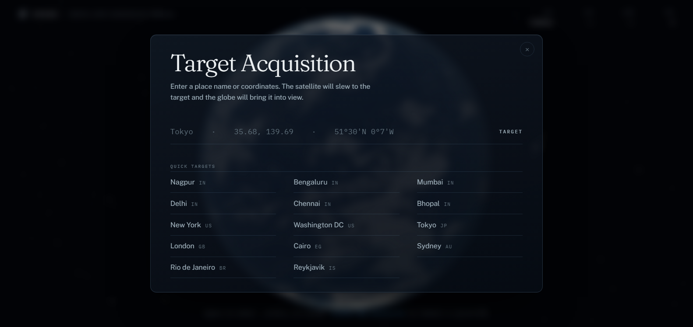
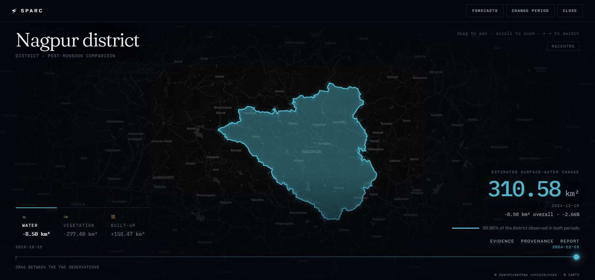
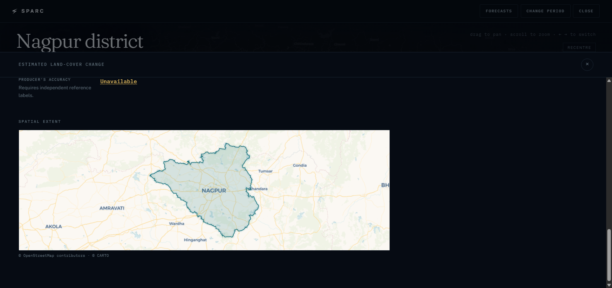
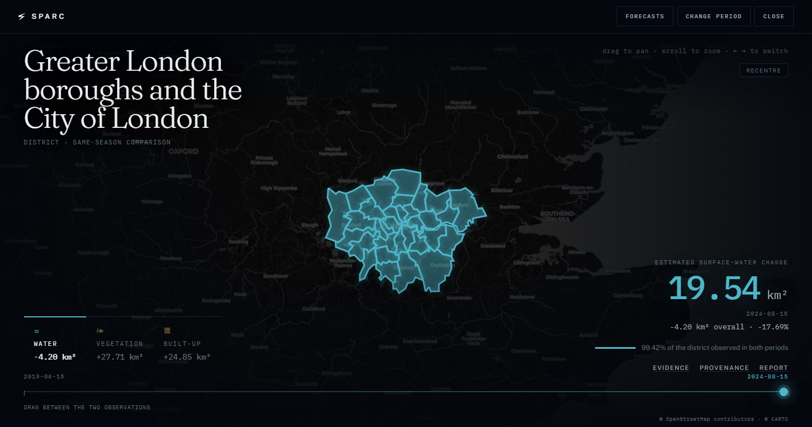
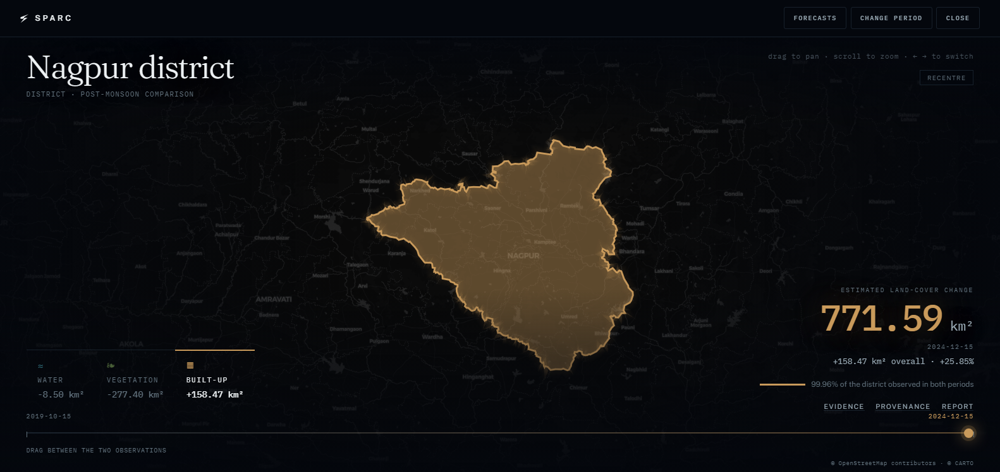

<div align="center">

# SPARC

**Satellite-Powered Analytics for Resource Conservation**

District-level environmental change, measured from open Earth-observation data
and traceable back to the scene it came from.

[](LICENSE)


[**Live demo**](https://sparc-git-main-sanskars-projects-31a9e8dd.vercel.app/) ·
[Methodology](docs/indicator-methodology.md) ·
[API contract](docs/architecture/api-contract.md) ·
[Architecture](docs/architecture/system-architecture.md)



</div>

---

## What it does

SPARC turns satellite imagery into a *before and after* a district administrator
can act on. Pick a place, pick two same-season windows, and read the change in
three land-cover proxies — surface water, vegetation, and built-up area — with
the method, the scene IDs and the coverage statistics attached to every figure.

It is built around one rule: **a number you cannot trace is not a result.** Every
value on screen carries its provenance, and a measurement that could not be made
to standard is reported as unavailable with a reason rather than as a zero.

> SPARC outputs are satellite-derived **SDG proxy indicators**, not official UN
> SDG indicators. They describe observed surface patterns and do not establish
> a cause.

## The journey

| | |
|---|---|
| **1 · Target** — search a place or pick from the catalogue. The satellite slews and the globe brings it into view. |  |
| **2 · Read** — the district on a real basemap. Switch measurement laterally, drag the time handle between the two observations and watch the scene respond. |  |
| **3 · Verify** — coverage, threshold sensitivity, scene inventory, algorithm version and parameter hash, in a sheet that rises over the map. |  |

Boundaries are real administrative geometry, not bounding boxes — including
multi-part districts such as Greater London's 33 boroughs and New York's five
counties.

<p align="center">
  
  
</p>

## Quick start

Requires **Node 20+** and **Python 3.11+**.

```bash
# 1 — build the client and serve the whole product from one origin
cd apps/web
npm ci
npm run build
node serve.mjs 8080          # → http://localhost:8080
```

That is the complete demo path: the globe, the analytical client and the bundled
result packs, from a single static origin with no API process and no network.

To exercise the contract-backed API instead:

```bash
# 2 — optional: the FastAPI service
python -m venv .venv && .venv/bin/pip install -r requirements.txt
python -m uvicorn apps.api.app.main:app --port 8000

# then rebuild the client against it
VITE_API_BASE_URL=http://localhost:8000 npm --prefix apps/web run build
```

Report packaging (PDF + evidence bundle) needs the API. Copy `.env.example` to
`.env` and set `GEMINI_API_KEY` if you want AI-assisted drafting; without it the
deterministic local generator is used.

## Architecture

```text
Browser — globe-led entry (orbital-website/)
   │
   └── analytical client (apps/web/)
         ├── DemoTransport → bundled manifest + checksum-verified JSON packs
         └── ApiTransport  → FastAPI /api/v1
                               ├── bounded fixture repository (default)
                               └── precomputed Earth Engine pack adapter
```

Both transports converge on one view model, so a screen renders identically
regardless of where the bytes came from. Neither path performs request-time
raster processing, database access or provider calls.

**Client** React 18 · TypeScript · Vite · MapLibre GL · three.js
**Service** FastAPI · Pydantic v2 · ReportLab
**Data** Sentinel-2 L2A via Earth Engine · geoBoundaries (ODbL) · Natural Earth
**Basemap** OpenStreetMap via CARTO, with a bundled vector fallback for offline

## Offline

The judged path runs with the network unplugged. Result packs, boundaries, fonts
and the fallback basemap are all bundled; the raster basemap is probed once and
degrades to bundled vectors when it is unreachable. Nothing about the analysis
changes either way — the basemap is context, never data.

## Testing

```bash
python -m pytest                      # contract, repository, reporting, geo
npm --prefix apps/web run typecheck   # strict TypeScript
npm --prefix apps/web run build       # type-check + production bundle
node orbital-website/test-geo.mjs     # coordinate parsing and projection
node orbital-website/test-e2e.mjs     # 29 checks driven over CDP
```

The end-to-end suite drives a real browser through the globe, the satellite
click, targeting, slew and marker placement, and fails on any console error.

## Documentation

**Start here** — [requirements](SRS.md) · [delivery status](docs/project-status.md) · [demo script](docs/demo-script.md)

<details>
<summary><b>Full index</b></summary>

### Science and data
- [Indicator methodology](docs/indicator-methodology.md) — formulas, thresholds, QA gates
- [Validation plan](docs/validation-plan.md)
- [Data sources](docs/data-sources.md) · [open-source reuse](docs/open-source-reuse.md)
- [Technical research](docs/research/SPARC-technical-research.md) · [source register](docs/research/source-register.md)

### Architecture
- [System architecture](docs/architecture/system-architecture.md)
- [Data pipeline](docs/architecture/data-pipeline.md) · [pipeline hardening](docs/architecture/pipeline-hardening.md)
- [API contract](docs/architecture/api-contract.md) · [OpenAPI](contracts/openapi.yaml) · [schemas](packages/contracts/schemas/sparc.schema.json)
- [Data storage](docs/architecture/data-storage.md) · [offline strategy](docs/architecture/offline-demo-strategy.md)
- [3D asset integration](docs/architecture/3d-asset-integration.md)
- [Decision records](docs/decisions/) · [security review](docs/security-review.md)

### Delivery
- [Development roadmap](docs/development-roadmap.md) · [integration plan](docs/integration-plan.md)
- [Testing plan](docs/testing-plan.md) · [deployment guide](docs/deployment-guide.md)
- [Git workflow](docs/git-workflow.md) · [risk register](docs/risk-register.md)
- [Business viability](docs/business-viability.md) · [judging checklist](docs/judging-checklist.md)

### Reporting workflow
- [Workflow](docs/reporting/reporting-workflow.md) · [Gemini drafting](docs/reporting/gemini-drafting.md) · [privacy and legal](docs/reporting/privacy-and-legal.md)

</details>

## Security

- Secrets are server-side environment variables only. `VITE_` values are compiled
  into the browser bundle and may hold non-secrets exclusively.
- Read-only endpoints need no authentication; job creation is restricted.
- Layer APIs resolve opaque allowlisted IDs and never fetch caller-controlled URLs.
- Raw scenes, working rasters, credentials and signed URLs are excluded by `.gitignore`.

See [docs/security-review.md](docs/security-review.md).

## Attribution

Boundary geometry is [geoBoundaries](https://www.geoboundaries.org/) gbOpen
(ODbL 1.0, share-alike). Basemap tiles are © OpenStreetMap contributors, ©
CARTO. Imagery is Copernicus Sentinel-2 accessed through Google Earth Engine.
Third-party code and data retain their original licences — see
[open-source reuse](docs/open-source-reuse.md) and
[data sources](docs/data-sources.md) before redistributing.

## Licence

[Apache License 2.0](LICENSE) — permissive, with an explicit patent grant.

This covers SPARC's own source. It does **not** relicense the data: geoBoundaries
is ODbL 1.0 with a share-alike obligation, and OpenStreetMap tiles carry their
own attribution terms. [NOTICE](NOTICE) lists what applies to what.

## Contributing

See [CONTRIBUTING.md](CONTRIBUTING.md) and the [git workflow](docs/git-workflow.md).
