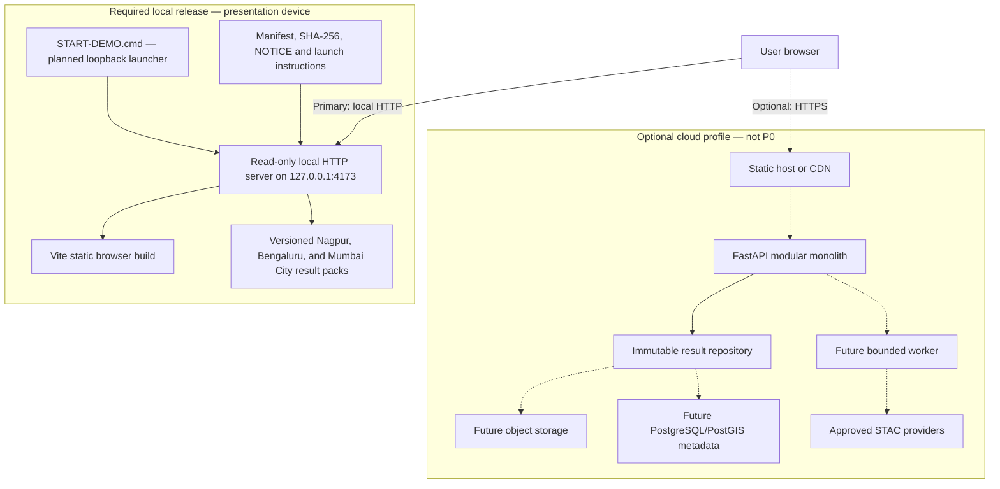

# SPARC deployment guide

**Status:** Local deployment only; Vercel deployment intentionally deferred
**Primary profile:** local HTTP, precomputed result packs
**Cloud profile:** Deferred; no cloud deployment is part of the current release

## 1. Current-state warning

The repository now contains a Vite dashboard, FastAPI function entrypoint, precomputed result packs, and Vercel assembly configuration. Therefore:

- `npm run vercel-build` and the API/dashboard tests have been run locally.
- `vercel.json`, `package.json`, `scripts/vercel/assemble.mjs`, `api/index.py`, and `requirements.txt` define the cloud build.
- Vercel configuration remains in the repository as an optional historical path; it is not an active release target.
- Local report creation requires the FastAPI service and a server-side `GEMINI_API_KEY` when Gemini drafting is selected.
- Contract mocks must not be labelled as real satellite findings.

The local runbook remains the recovery path and must be kept runnable even when the cloud deployment is unavailable.

## 2. Deployment profiles

| Profile | Purpose | Required at judging time | Runtime dependencies | Data source |
|---|---|---:|---|---|
| Local demo | Primary judged and recovery path | Yes | Browser plus packaged loopback static server | Immutable Nagpur/Bengaluru/Mumbai City packs |
| Local integration | Developer verification of API transport | No | Browser build, FastAPI and immutable result repository | Precomputed pack; approved live adapter only in explicit tests |
| Optional cloud | Shareable URL after P0 is safe | No | Static host/CDN; optional FastAPI service | Immutable objects; future provider adapters |
| Future production | Post-hackathon evolution | No | Managed static hosting, API, workers, object storage and metadata database | Versioned results and bounded jobs |

The local demo profile is not a degraded product. It is the most reliable P0 delivery mechanism and uses the same public schemas as API mode.

## 3. Deployment architecture



Solid local connections are required. Dotted cloud/worker/database connections are optional and must not become a dependency of the judged path.

## 4. Release artifact contract

The Day 3 release directory must be immutable after verification and contain:

```text
sparc-release-<version>/
  START-DEMO.cmd              # planned Windows entry action
  START-DEMO.txt              # human-readable action, URL and recovery
  <approved-loopback-server>  # packaged only after license/security review
  web/                        # Vite production output
  web/demo/v1/                # primary and backup immutable packs
  NOTICE.txt                  # code/data attribution and notices
  CHECKSUMS.sha256
  RELEASE.json                # versions, commit, generated time, mock=false gate
  TEST-EVIDENCE/              # sanitized results; no credentials/raw private data
```

The future `START-DEMO.cmd` contract is exact even though the file is not implemented yet:

1. bind the packaged static server to `127.0.0.1` only;
2. serve only the release `web/` directory, read-only, without listing or upload;
3. use port `4173`, or stop with a clear error if it is unavailable—do not silently choose a different URL;
4. print `Open http://127.0.0.1:4173/`;
5. return a non-zero exit code on startup failure;
6. reveal no environment variables, local user path or credential; and
7. terminate cleanly when its console closes.

The tested presentation action is planned to be: **double-click `START-DEMO.cmd`, wait for the success line, then open `http://127.0.0.1:4173/`.** The expected first screen is the SPARC district selection/overview with a visible data-source and generation-date notice. This action must be rehearsed on the actual presentation and backup devices before release; until the launcher exists, it is a requirement, not evidence.

Do not use `file://`. Do not improvise with a globally installed development server during judging.

## 5. Configuration and secrets

The names in `.env.example` are proposed configuration; no current application reads them.

| Variable | Runtime | Secret? | Rule |
|---|---|---:|---|
| `VITE_API_BASE_URL` | Browser build | No | Public API origin only; compiled into client assets |
| `VITE_DATA_MODE` | Browser build | No | Public `demo`/API-mode selection; never a credential |
| `SPARC_DATA_MODE` | FastAPI/server | No | Server behavior selection |
| `SPARC_DEMO_DATA_ROOT` | FastAPI/server | No, but path-sensitive | Resolve against an approved root; do not return it to clients |
| `SPARC_ALLOWED_ORIGINS` | FastAPI/server | No | Explicit origins; no wildcard when credentials are used |
| `EARTH_ENGINE_PROJECT` | Offline worker | No, but deployment-specific | Google Cloud project ID used only by the Earth Engine worker; never browser/static output |

Local demo mode needs no provider credential. Earth Engine authentication is stored in the worker user's local Earth Engine configuration, not in `.env` or the repository. Any real secret found in a tracked file or release artifact must be revoked and rotated, even if the file is later removed. `VITE_*` values are public by design and can never carry secrets.

## 6. Build and packaging procedure

The following is the required sequence. The implementation must record the exact command beside each gate once scripts exist.

1. **Select an immutable source revision.** Record branch, commit, schema version and intended dataset version.
2. **Perform a clean dependency restore.** Use committed lockfiles and a supported offline-capable release cache. Exact command: **to be recorded after manifests exist**.
3. **Run contract checks.** Parse OpenAPI, resolve references and validate mocks plus real release payloads. Exact command: **to be recorded after test tooling exists**.
4. **Run processing verification.** Reproduce data products or verify the signed/hashed production outputs; do not hand-edit values.
5. **Build the Vite static application.** Exact command and output directory: **to be recorded after `apps/web` is scaffolded**.
6. **Assemble only reviewed public assets.** Copy the Nagpur, Bengaluru, and Mumbai City packs, static layers, local fonts/icons and notices. Exclude raw scenes, interim rasters, `.env`, caches and optional model binaries unless separately approved.
7. **Generate the manifest and checksums.** Verify all relative paths, media types and byte counts. Reject mock placeholders in claimed real data.
8. **Add the approved packaged launcher.** Review its license and prove loopback/read-only behavior.
9. **Scan the full directory.** Check secrets, absolute local paths, signed URLs, missing notices and required remote origins.
10. **Cold-test and freeze.** Follow [testing plan](testing-plan.md), copy the verified directory without modification and label it with a unique release version.

No package-install, data-download or provider call may be required on the presentation network.

## 7. Local demo runbook

### Preflight

- [ ] Confirm release-directory and `CHECKSUMS.sha256` hashes match.
- [ ] Confirm the laptop date/time, power, browser and display scaling are suitable.
- [ ] Confirm port `4173` is free before launching.
- [ ] Disconnect the network before the final cold-start check.
- [ ] Keep the immutable backup copy and backup device available.

### Start

1. Double-click planned `START-DEMO.cmd` in the verified release directory.
2. Require the console to report exactly `Open http://127.0.0.1:4173/`.
3. Open that URL in a clean browser window.
4. Confirm the first screen shows the mode badge, dataset generation date and Nagpur/Bengaluru/Mumbai City choices.
5. Follow [demo script](demo-script.md).

### Stop

Close the launcher console or use its documented stop action. Confirm port `4173` is no longer listening. The launcher must not leave a persistent service, scheduled task or firewall exception.

### Local recovery

| Failure | Recovery |
|---|---|
| Port occupied | stop the known conflicting local process if safe, then relaunch; otherwise use the already-tested backup device—not an undocumented port |
| Launcher fails | use the separately tested immutable copy/device; do not open `index.html` directly |
| Primary pack hash fails | do not show its metrics; select the verified Bengaluru pack or backup copy |
| WebGL/layer fails | use static image, legend, metrics and table |
| FastAPI/internet fails | remain in visibly labelled DemoTransport; no API is needed |

## 8. Local API integration profile

This profile is for development and evidence that both transports match. The OpenAPI contract proposes `http://localhost:8000` for FastAPI, but no server exists yet.

Planned flow:

```text
browser at approved local origin
→ short GET /api/v1/health
→ contract-compatible read-only result endpoint
→ immutable result repository
→ browser view model identical to DemoTransport
```

Required controls:

- bind only to an intended interface;
- use explicit CORS origins;
- perform no expensive raster processing in request handlers;
- keep job creation disabled unless authentication, authorization, idempotency and rate limits are tested;
- return sanitized `application/problem+json` failures;
- resolve only opaque allowlisted layer IDs;
- expose no automatic API documentation in a public production profile unless intentionally reviewed.

An API health check proves process liveness only. It must not call providers, reveal configuration or be treated as scientific-data validation.

## 9. Vercel cloud profile

The repository has a Vercel deployment path. `npm run vercel-build` builds the browser bundle and `scripts/vercel/assemble.mjs` places the dashboard under `/app/`; `api/index.py` is the FastAPI function under `/api/*`. The routing rules in `vercel.json` send API paths to the function and allow static files to pass through first.

Configure these values in Vercel Project Settings, never in committed files:

- `GEMINI_API_KEY` (optional; required only for Gemini-assisted report drafting);
- `GEMINI_MODEL` (optional model override).

The browser uses same-origin API calls. `SPARC_DATA_MODE=precomputed` serves the checked-in result packs. Report records remain process-local and ephemeral in this P0 deployment; a durable shared store is still required before production-scale reporting.

The deployment must provide:

- static assets over HTTPS with immutable hashed caching;
- FastAPI request-size, timeout and rate limits;
- private secrets from Vercel Project Settings;
- explicit CORS, security headers and sanitized observability;
- deployment, dataset and schema versions visible for support;
- rollback to a known compatible application-and-data pair.

Do not provision PostGIS, a queue or dynamic tile service merely to satisfy a diagram. Add them only when measured production requirements justify operational cost and complexity.

## 10. Cloud release and rollback gates

1. Deploy to an isolated Vercel preview using the Vercel deployment integration.
2. Verify `/app/`, `/api/v1/health`, `/api/v1/regions`, the three published district journeys, and report artifact download.
3. Verify browser content, mode badge, provenance and data versions over HTTPS.
4. Check no private origin, credential, source map or raw stack trace is public.
5. Force API `500`, upstream `503`, missing layer and old-manifest/new-shell mismatch.
6. Promote the same immutable artifacts only after explicit production approval; do not rebuild between staging and release.
7. Preserve the previous compatible application and dataset versions.
8. On failure, route back to the preserved pair; do not mix a new shell with an old incompatible schema.

Cloud rollback does not affect the local judged copy. If cloud verification is incomplete, the correct action is not to deploy.

## 11. Observability and incident hygiene

If API mode is enabled, record sanitized request ID, operation, status, duration, data mode, result/version ID and coarse failure code. Do not log bearer tokens, provider credentials, query secrets, signed URLs, complete raw provider responses, absolute local paths or sensitive user data. P0 has no accounts and should collect no personal data.

Release evidence should make these separate:

- application availability;
- data-pack integrity;
- contract compatibility;
- upstream availability;
- scientific quality/validation status.

A green health endpoint cannot compensate for a corrupt pack or an unvalidated result.

## 12. Deployment acceptance

- [ ] Exact build and start commands are present and have actually run; no “to be recorded” marker remains in the operational copy.
- [ ] Local launcher binds `127.0.0.1:4173`, serves a fixed directory read-only and exits cleanly.
- [ ] Nagpur, Bengaluru, and Mumbai City journeys pass with network disabled from cold start.
- [ ] Browser assets require no remote runtime CDN, public basemap or provider call.
- [ ] No secret, mock claim, temporary signed URL or absolute workstation path exists in the bundle.
- [ ] Manifest, checksums, notices and dataset/schema versions agree.
- [ ] API/WebGL/layer/3D failures preserve a usable supported recovery.
- [ ] Optional cloud failure cannot change or invalidate the local release.

Related documents: [offline strategy](architecture/offline-demo-strategy.md), [system architecture](architecture/system-architecture.md), [testing plan](testing-plan.md), [risk register](risk-register.md) and [Git workflow](git-workflow.md).
